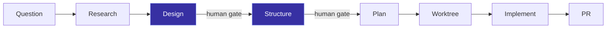

# TEAM
{: .fs-9 }

The autonomous engineering mesh for Claude Code.
{: .fs-6 .fw-300 }

[Get started](#install){: .btn .btn-primary .fs-5 .mb-4 .mb-md-0 .mr-2 }
[View on GitHub](https://github.com/bostonaholic/team){: .btn .fs-5 .mb-4 .mb-md-0 }

---

## What is TEAM?

TEAM orchestrates a mesh of **13 specialized agents** — from blind researchers to adversarial reviewers — that drive a feature through an 8-phase pipeline (QRSPI) and deliver a verified pull request. Agents are decoupled microservices: each consumes a predecessor artifact on disk, does its work, and writes its own artifact. The orchestrator (the main Claude Code session) walks a linear phase table and runs two human approval gates.

## The Pipeline



| Phase | What happens |
|-------|-------------|
| **Question** | Decompose intent into `task.md` + neutral `questions.md`. The questioner is the only agent that ever sees your original description. |
| **Research** *(blind)* | Parallel agents (file-finder + researcher) consume only `questions.md`. They never see the task — structurally preventing opinion-bias. |
| **Design** *(human gate)* | The design author runs an interactive interview, then drafts a ~200-line alignment doc. You review here. |
| **Structure** *(human gate)* | Break the design into vertical slices with verification checkpoints. ~2-page doc. You review here. |
| **Plan** | Tactical implementation plan derived from the approved structure. Read by the implementer; not human-gated. |
| **Worktree** | Orchestrator prepares an isolated git worktree. |
| **Implement** | Test-first → slice execution → 5 parallel reviewers + typed retry loop. |
| **PR** | Update changelog, commit, open pull request. |

## Install

TEAM is a Claude Code plugin. Add it to your Claude Code installation:

```bash
claude plugin add /path/to/team
```

Then run a phase end-to-end:

```bash
/team Add rate limiting middleware to all API endpoints
```

For a focused bug fix that skips the QRSPI ceremony:

```bash
/team-fix Users see stale cache after profile update
```

## Read next

- **[Architecture](architecture.md)** — full design, artifact frontmatter, phase-inference rules.
- **[Beads Workflow](beads-workflow.md)** — how this project tracks issues across sessions.
- **[GitHub repository](https://github.com/bostonaholic/team)** — source, agents, skills.
