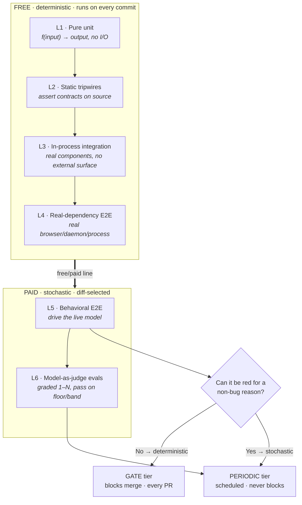
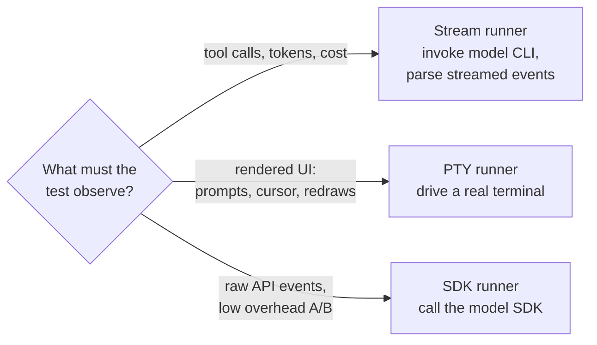
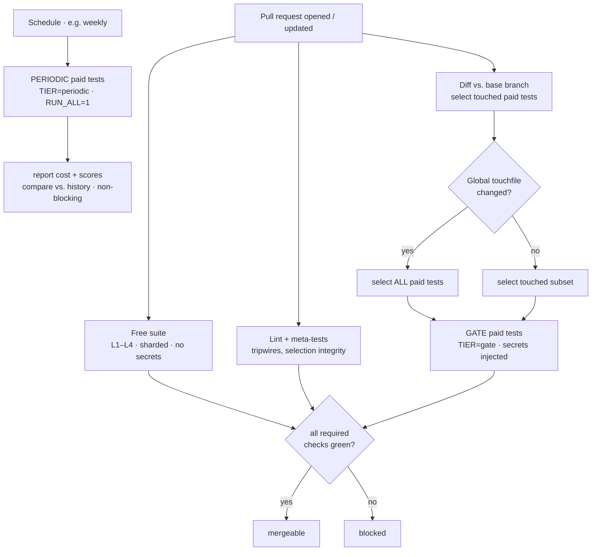

# Testing — a test harness for products where the model is part of the system

This is Team's blueprint for testing a product that mixes ordinary software with
**non-deterministic components** — most often a large language model, but the
same shape applies to anything whose output you can only judge by quality (a
recommender, a search ranker, a generative pipeline, a heuristic planner).

Team's harness is TypeScript on **Bun** (`bun test`); the non-deterministic
component under test is driven through the **`claude`** CLI, and diff-based
selection compares against **`origin/main`**. Those are Team's concrete choices —
nothing in the design below assumes a particular framework, language, or model
vendor.

---

## 1. The core problem

The classic **Test Pyramid** sorts tests along one axis: *integration scope*
(unit → integration → end-to-end). It assumes every test is deterministic — the
same input always yields the same pass/fail.

That assumption breaks the moment part of your system is a model. The "function
under test" is now a probability distribution. Run the same prompt twice and you
may get different words, a different number of findings, a different tool call.
You cannot `assertEqual` your way through it, and you cannot block a merge on a
check that is red 8% of the time for no reason.

So this harness keeps the pyramid's scope axis **and adds a second axis:
determinism and cost.** Every test lives at a coordinate of *(scope,
determinism)*. The whole design is the discipline of **pushing each check as far
down and as far toward "deterministic" as it will go** — because the cheapest,
most reliable place to catch a given bug is almost never an expensive model eval.

```text
  determinism →  HIGH (deterministic, free, fast)        LOW (stochastic, paid, slow)
  scope ↓
  unit          pure-function tests                       —
  integration   in-process component tests                —
  e2e           real-dependency tests (browser/daemon)    live-model behavioral tests
  quality       static contract "tripwires"               model-as-judge evals
```

The two axes produce a **six-layer harness**. The bottom four are the classic
pyramid (free, deterministic). The top two are the part most test suites lack:
graded checks on stochastic behavior.

---

## 2. The six layers

```text
                          ▲ $ cost        ▲ non-determinism
   ┌───────────────────────────────────────────────────────────┐
   │  L6  QUALITY EVALS — model-as-judge                       │ $$$ paid
   │      "is the output good?" graded 1–N, pass = floor/band  │ stochastic
   ├───────────────────────────────────────────────────────────┤
   │  L5  BEHAVIORAL E2E — drive the live model                │ $$ paid
   │      "does it DO the right thing?" deterministic guards   │ gate + periodic
   ╞══════════════════ PAID  /  FREE  LINE ════════════════════╡
   │  L4  REAL-DEPENDENCY E2E — real browser/daemon/process    │ $ slow, free
   ├───────────────────────────────────────────────────────────┤
   │  L3  INTEGRATION — real components, no external surface   │ fast, free
   ├───────────────────────────────────────────────────────────┤
   │  L2  STATIC-INVARIANT TRIPWIRES — assert on the source    │ <100ms, free
   │      grep the code/config; fail when a contract is broken │ ← the multiplier
   ├───────────────────────────────────────────────────────────┤
   │  L1  PURE UNIT — pure functions, no I/O                   │ <50ms, free
   │      the wide base                                        │
   └───────────────────────────────────────────────────────────┘
```

### L1 — Pure unit (the wide base)

Pure functions: parsing, formatting, validation, version math, data transforms.
No I/O, no network, no model. Hermetic — if a test needs a temp dir, make one
keyed by `pid`+timestamp and delete it after. This is where most of your test
*count* lives and where each test costs microseconds.

**Rule of thumb:** if a behavior can be expressed as `f(input) -> output`, it
belongs here, and almost everything that *can* be refactored into that shape
*should* be, precisely so it can be tested here.

### L2 — Static-invariant "tripwires" (the highest-leverage layer)

These tests do not run behavior. They **read your own source or config and
assert a contract with a pattern match.** They are executable architecture
documentation.

Every load-bearing rule in your codebase — "never import X from Y," "all writes
must route through this helper," "this name must not collide with a reserved
word," "importing this module must have no side effects" — gets a test that
**fails the build when someone violates it**, in milliseconds, without executing
anything.

Canonical forms:

- **Forbidden-pattern tripwire** — fail if a banned call reappears
  (`grep` for the dangerous API; assert zero matches outside an allowlist).
- **Required-routing tripwire** — fail if a sensitive operation isn't funneled
  through its safe wrapper.
- **No-side-effect tripwire** — spawn a subprocess, import the module, assert it
  bound no port / wrote no file / registered no handler.
- **Ordering tripwire** — parse a file, assert call A precedes call B (e.g. a
  scan must run before the thing it protects).
- **Collision / drift tripwire** — assert generated artifacts are fresh, names
  don't shadow reserved ones, enums in two files stay in sync.

**Discipline:** when you write a comment that says "NEVER do X here," write the
tripwire in the same change. A constraint without a test is a suggestion.

This layer is what lets a stochastic product stay correct cheaply: a huge
fraction of "regressions" are really *contract violations*, and contracts are
deterministic even when behavior isn't.

### L3 — In-process integration

Real components wired together, but **no external surface**. Stand up an
in-memory server fixture, call the real request handler, exercise the real
dispatch path. Subprocess-snapshot tests (spawn the program, capture stdout /
files written / exit code) live here too. Fast and free because nothing leaves
the box.

### L4 — Real-dependency E2E (slow, still free)

Launch the *real* heavy dependency — a real browser, a real daemon, a real
child process — and drive it. Reserve this for cases where **the integration is
the thing under test** (lifecycle, concurrency, file locking, signal handling,
real rendering). Mock the world, never the subject. Use env knobs to accelerate
timers so a 5-minute watchdog test runs in 5 seconds.

These cost wall-clock time but no money, so they can still run on every PR.

### L5 — Behavioral E2E against the live model (the paid frontier)

Here the unit under test is a **prompt or a policy**, and you must call the real
model to test it. Split this layer by determinism:

- **Deterministic guardrails** — the output must contain / must never contain a
  specific thing. "Given a planted vulnerability, the review must flag it."
  "Given a read-only mode, the agent must never call the write tool." These
  **pass or fail cleanly** and can gate merges.
- **Quality benchmarks** — the same behavior on an expensive model, or where the
  bar is subjective. These go to a non-blocking tier (see §4).

**Pick the runner by what it can observe**, not by convenience. A model can be
driven three common ways, each with a different observation surface:

| Runner style | Mechanism | Observes | Use when |
| --- | --- | --- | --- |
| **Stream runner** | invoke `claude`, parse streamed events | tool calls, tokens, cost | most behavioral E2E; stateless and repeatable |
| **PTY runner** | drive a real terminal | the **rendered UI** (interactive prompts, cursor, redraws) | testing UI the event stream can't see |
| **SDK runner** | call the model SDK directly | raw API events | A/B-ing system prompts / config with low overhead |

The point of three runners is not redundancy — it's that **some behavior only
exists on one surface.** An interactive confirmation rendered to a TTY does not
appear in a JSON event stream; test the surface the user actually experiences.

### L6 — Quality evals (model-as-judge)

When correctness is genuinely subjective — prose quality, "are these findings
real," "is this the right recommendation" — use a **second model to grade the
first**. Keep it cheap and honest:

- **Use a cheaper model as the judge** than the one being judged where you can.
- **Cascade** — gate the expensive judge behind cheap deterministic checks. Only
  pay for a model call when a regex/heuristic says it's warranted.
- **Score on a rubric (1–N), pass on a floor or a band — never on exact match.**
  "Detection rate ≥ ground-truth floor and false positives ≤ ceiling." "Count
  within ±2 of the seeded number." Bands are how you absorb non-determinism
  without flakiness.
- **Persist scores across runs** so you can see quality drift, not just today's
  pass/fail.

---

## 3. Diff-based selection: only run what the change could have broken

A paid suite cannot run every test on every change. Make selection automatic:

1. **Each expensive test declares its source dependencies** ("touchfiles") — the
   files and globs that, if changed, could alter its outcome.
2. The runner diffs the branch against `origin/main` and **runs only the tests
   whose dependencies changed.**
3. A small set of **global touchfiles** triggers *everything* when touched — the
   shared runner, the result store, and **the selection map itself.** (If editing
   the selector didn't re-run everything, you could silently deselect a test by
   editing one line. Close that hole.)
4. An **escape hatch** (`RUN_ALL=1` or equivalent) forces the full suite for
   releases and scheduled runs.

This is the difference between a paid suite that costs a few dollars per change
and one nobody can afford to run.

---

## 4. Two tiers: determinism decides the gate, cost decides the cadence

Classify every paid/behavioral test as **gate** or **periodic**:

- **Gate** — deterministic guardrail or cheap functional check. **Blocks merge.**
  Runs on every PR (after diff-selection).
- **Periodic** — quality benchmark, expensive-model run, externally-dependent, or
  otherwise non-deterministic. **Never blocks merge.** Runs on a schedule
  (e.g. weekly cron) or on demand, with selection forced to "all."

The classification rule is a single question:

> Can this test be red for a legitimate, non-bug reason (model variance, a flaky
> external service, a subjective threshold)?
> **Yes → periodic. No → gate.**

You can never gate CI on a check that is sometimes-red-for-no-reason; doing so
trains everyone to ignore red. Gate on what's stable, monitor what's fuzzy.

**Two-axis matrix in practice:**

|               | Deterministic               | Non-deterministic        |
|---------------|-----------------------------|--------------------------|
| **Cheap**     | gate, every PR              | periodic (or band-gated) |
| **Expensive** | gate if rare; else periodic | periodic, scheduled      |

---

## 5. Free vs. paid: the line that organizes everything

Draw one hard line between **free** (no model, no metered API, no money) and
**paid**, and wire your tooling around it:

- A default command (`bun test`) runs **only the free tiers** (L1–L4).
  Sub-second to low-tens-of-seconds. Run it before every commit. It must be
  cheap enough that *not* running it is never tempting.
- A separate command runs the **paid tiers** (L5–L6), diff-selected, before
  shipping and in CI.
- CI runs the **gate** subset of paid tests and blocks merge; a scheduled job
  runs the **periodic** subset and reports.

Keep the free suite genuinely free — one stray metered call buried in a "unit"
test poisons the whole base. A tripwire that greps tests for forbidden paid
calls (`grep` for the model CLI / SDK import in the free test roots) is a good
L2 guard for exactly this.

Token-consuming CI jobs are additionally restricted to trusted PR authors
(OWNER/MEMBER/COLLABORATOR); untrusted PRs (forks, Dependabot, first-time
contributors) skip them — a security control against token-spend griefing,
not just a cost optimization. This is forward-proofing: the
`behavioral-evals.yml` gate is dormant until a `pull_request` trigger is added,
while `harness-checks.yml` carries the trust expression as a documented-only
contract for the same reason — so the control is already in place the moment a
paid step attaches.

---

## 6. Meta-tests: test the test system

Once the harness has structure, protect the structure itself:

- **Coverage audit** — every component of a given class (e.g. every interactive
  surface) *must* have at least one test of the right kind. Fail CI if a new one
  ships without one.
- **Selection integrity** — the diff-selection map parses, has no dangling
  entries, and every declared test exists.
- **Shard/parallel integrity** — if you shard the free suite across CI workers,
  test that the sharding is stable and total (every file lands in exactly one
  shard).
- **Portability detection** — if you support multiple OSes, scan tests for
  platform-fragile patterns (hardcoded `/tmp`, POSIX-only shells, path
  separators) and curate a known-safe subset for the other platform's CI.

Meta-tests are themselves L2 tripwires pointed at your own test directory.

---

## 7. Cost is a design constraint, engineered down

Treat money like latency — a budget you architect against, not an afterthought:

- **Diff-based selection** (§3) — don't run what couldn't have changed.
- **Tiering** (§4) — expensive runs go off the critical path.
- **Judge cascades** (§2, L6) — pay for a model only after cheap checks justify it.
- **Cheaper judge than generator** — grade with a smaller model where viable.
- **Fixture replay** — for an expensive deterministic check, record the costly
  call once into a committed fixture and replay it; re-record only when the
  inputs that define it change (guard that with a tripwire on the input files).
- **Persist and compare** — store every paid run's cost and scores so regressions
  in *spend* are as visible as regressions in *quality*.

The goal is a paid suite that costs a few dollars per change set, not hundreds.

---

## 8. Cross-cutting principles

- **Hermetic by construction, real where it counts.** Fakes and stubs for
  determinism (a fake CLI on `PATH`, a stub upstream server, scripted child
  processes). Real heavy dependencies only when the integration *is* the subject.
- **Refactor toward testability at the lowest layer.** Every pure function you
  extract is a behavior you can pin in L1 instead of paying for in L5.
- **A constraint that matters gets a tripwire.** L2 is where architecture
  decisions become enforceable. Write the tripwire with the rule.
- **Pin every fixed bug with a regression test named for it.** One file per bug,
  named `regression-<id>-<slug>`, asserting the specific fix. They cost nothing
  and never let the same bug back in.
- **Floors and bands, not exact match, for anything stochastic.** Determinism
  where you can engineer it; tolerance where you can't.
- **Observation surface dictates the tool.** Test what the user actually sees.
- **No "pre-existing failure" without proof.** Before blaming a flake on
  something other than your change, reproduce it on the base branch. Stochastic
  systems have invisible couplings; "not my change" is a claim that needs a
  receipt.
- **Don't chase a coverage or lint number.** Accept a "worse" pattern when it's
  the correct engineering choice; fix patterns that are genuinely bugs. The
  number is a smell test, not a target.

---

## 9. Adopting this in a new project

A pragmatic order of operations:

1. **Draw the free/paid line.** Make `bun test` run only free tiers.
   Get L1 (pure unit) populated first — it's the cheapest coverage you'll ever buy.
2. **Add tripwires (L2) for your top 10 "NEVER do X" rules.** Highest leverage
   per line of test you will write. Each is a few minutes and prevents a class of
   regression forever.
3. **Stand up in-process integration (L3)** with a fixture server/handler so you
   can test real dispatch without the network.
4. **Add real-dependency E2E (L4)** only for the lifecycle/concurrency cases that
   demand it. Accelerate timers via env.
5. **If you have a model in the loop, build one behavioral runner (L5)** for the
   surface you care about most, and write **deterministic guardrails first** —
   they're the ones you can gate on.
6. **Add diff-based selection and the gate/periodic split** as soon as the paid
   suite costs enough to notice. Wire CI to run gate-on-PR, periodic-on-schedule.
7. **Add model-as-judge evals (L6) last,** with cascades and band-based passing,
   for the genuinely subjective quality you can't pin any other way.
8. **Add meta-tests** once the structure is worth protecting.

You do not need all six layers on day one. You need the **free/paid line**, a
**wide L1 base**, and the **tripwire habit**. The upper layers earn their place
as the stochastic surface of your product grows.

---

## 10. One-page summary

- **Two axes, not one:** scope *and* determinism/cost. Push every check down and
  toward deterministic.
- **Six layers:** pure unit → tripwires → integration → real-dependency E2E →
  live-model behavioral → model-as-judge.
- **Tripwires (L2)** are the multiplier: assert contracts on the source, fail in
  milliseconds, no execution. Write one with every "NEVER" rule.
- **Determinism decides the gate; cost decides the cadence.** Only deterministic
  checks block merges. Stochastic checks run on a schedule and pass on bands.
- **Diff-based selection** runs only what a change could break; global touchfiles
  (including the selector itself) re-run everything.
- **Cost is architecture:** selection, tiering, judge cascades, cheaper judges,
  fixture replay, persisted spend.
- **Pick the runner by observation surface.** Test what the user sees.
- **Hermetic where you can, real where the integration is the point.**

---

## Appendix A — Diagrams

### A.1 The two-axis layer model

How the six layers sit against *scope* (vertical) and *determinism/cost*
(horizontal), and where the free/paid line falls.



### A.2 Pick the runner by observation surface



### A.3 CI execution flow

What happens on a pull request vs. on the schedule.



---

## Appendix B — CI skeleton

Drop-in scaffolding. It is intentionally vendor-neutral pseudo-config; adapt the
runner, CI platform, and secret names to your stack. Bracketed tokens are
placeholders.

### B.1 Test scripts (`package.json` example, or a `Makefile`/`justfile` equivalent)

```jsonc
{
  "scripts": {
    // FREE — runs on every commit. No model, no metered API, no money.
    // Must stay cheap enough that skipping it is never tempting.
    "test": "[test runner] test <free-test-roots> --exclude '<paid-glob>'",

    // FREE, sharded — for parallel CI workers (stable, total partition).
    "test:shard": "[test runner] run scripts/free-shards.[ext]",

    // PAID — diff-selected against the base branch. Run before shipping.
    "test:paid": "PAID=1 [test runner] test <paid-glob>",

    // PAID, gate subset — deterministic guardrails. What CI blocks on.
    "test:gate": "PAID=1 TIER=gate [test runner] test <paid-glob>",

    // PAID, periodic subset — quality/expensive/non-deterministic.
    "test:periodic": "PAID=1 TIER=periodic RUN_ALL=1 [test runner] test <paid-glob>",

    // PAID, ignore diff selection — for releases.
    "test:paid:all": "PAID=1 RUN_ALL=1 [test runner] test <paid-glob>",

    // Show which paid tests the current diff would select (dry run).
    "test:select": "[test runner] run scripts/select.[ext]"
  }
}
```

### B.2 Diff-based selection (sketch)

The data structure every paid test reads to decide whether to run.

```ts
// scripts/touchfiles.ts (or .py/.go — same shape in any language)

// Each paid test name → the source globs that, if changed, could alter it.
export const TOUCHFILES: Record<string, string[]> = {
  "feature-a-guardrail": ["src/feature-a/**", "src/shared/dispatch.*"],
  "feature-b-quality":   ["src/feature-b/**", "prompts/feature-b.*"],
};

// Tier of each paid test. Deterministic → gate; stochastic/expensive → periodic.
export const TIERS: Record<string, "gate" | "periodic"> = {
  "feature-a-guardrail": "gate",
  "feature-b-quality":   "periodic",
};

// Changing any of these re-runs EVERYTHING — shared infra + the selector
// itself, so you cannot deselect a test by editing one line.
export const GLOBAL_TOUCHFILES = [
  "test/helpers/run.*",       // the shared runner
  "test/helpers/store.*",     // the result store
  "scripts/touchfiles.*",     // this file
];

export function selectTests(changed: string[], tier?: "gate" | "periodic") {
  const global = changed.some(f => GLOBAL_TOUCHFILES.some(g => match(f, g)));
  return Object.keys(TOUCHFILES).filter(name => {
    if (tier && TIERS[name] !== tier) return false;
    if (process.env.RUN_ALL === "1" || global) return true;
    return changed.some(f => TOUCHFILES[name].some(g => match(f, g)));
  });
}
```

A test file then guards itself:

```ts
const selected = process.env.RUN_ALL === "1"
  || selectTests(diffAgainstBase(), process.env.TIER as any).includes("feature-a-guardrail");

describe.if(selected)("feature-a guardrail", () => { /* ... */ });
```

### B.3 Pull-request workflow (gate)

Runs on every PR. Blocks merge. Generic GitHub-Actions-style YAML; map to your
CI of choice.

```yaml
name: ci
on:
  pull_request:
    branches: ["[base branch]"]

jobs:
  free-tests:                      # L1–L4 · fast · no secrets
    runs-on: [runner]
    steps:
      - uses: actions/checkout@v4
        with: { fetch-depth: 0 }   # full history for diff selection
      - run: "[install]"
      - run: "[test runner] test"  # the free suite

  lint-and-meta:                   # tripwires + selection integrity
    runs-on: [runner]
    steps:
      - uses: actions/checkout@v4
      - run: "[install]"
      - run: "[lint command]"
      - run: "[test runner] test test/meta"   # coverage audit, selection map, shards

  gate-evals:                      # L5 gate subset · diff-selected · SECRETS
    runs-on: [runner]
    strategy:
      matrix:                      # parallelize by suite to cut wall-clock
        suite: [feature-a, feature-b, feature-c]
    steps:
      - uses: actions/checkout@v4
        with: { fetch-depth: 0 }
      - run: "[install]"
      - run: "[build]"
      - name: Run gate tests for ${{ matrix.suite }}
        env:
          PAID: "1"
          TIER: "gate"
          MODEL_API_KEY: ${{ secrets.MODEL_API_KEY }}
        run: "[test runner] test test/e2e-${{ matrix.suite }}.* --retry 2"

  # Branch protection: require free-tests + lint-and-meta + gate-evals to pass.
```

### B.4 Scheduled workflow (periodic)

Runs the stochastic/expensive tier off the critical path. Never blocks merges.

```yaml
name: evals-periodic
on:
  schedule: [{ cron: "0 6 * * 1" }]   # weekly, Monday 06:00 UTC
  workflow_dispatch: {}               # allow manual runs

jobs:
  periodic-evals:
    runs-on: [runner]
    strategy:
      matrix:
        suite: [feature-b, feature-c, external-service]
    steps:
      - uses: actions/checkout@v4
      - run: "[install]"
      - run: "[build]"
      - name: Periodic eval ${{ matrix.suite }}
        env:
          PAID: "1"
          TIER: "periodic"
          RUN_ALL: "1"              # ignore diff: run the whole tier
          MODEL_API_KEY: ${{ secrets.MODEL_API_KEY }}
        run: "[test runner] test test/e2e-${{ matrix.suite }}.* --retry 2"
      - name: Persist + compare cost/scores
        run: "[test runner] run scripts/eval-report.[ext]"   # store, diff vs. history
```

### B.5 Branch-protection checklist

- [ ] `free-tests` required — fast, deterministic, no secrets.
- [ ] `lint-and-meta` required — tripwires and selection integrity.
- [ ] `gate-evals` required — deterministic model guardrails only.
- [ ] `periodic-evals` **not** required — scheduled, reports, never blocks.
- [ ] Secrets exposed **only** to gate/periodic jobs, never to the free suite.
- [ ] Fork PRs: decide deliberately whether they receive model secrets (default:
      no — run free + meta only, or re-target the branch to a trusted remote).

